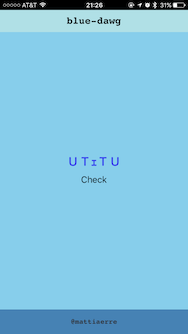

# blue-dawg Project Diary

**ＵＴｪＴＵ**

## 11/19/2016

- [Product brief](https://docs.google.com/document/d/1ZFJ6-v490c2Bm7QJqNwZI27bUGQUdlVPWy9QQD3EUE0/edit?usp=sharing)

- [Story map](https://blue-dawg.storiesonboard.com/m/blue-dawg)

- blue-dawg-v0-v0.1.0; mobile app powered by [Exponent](https://docs.getexponent.com/versions/v11.0.0/index.html)

## 11/28/2016

- blue-dawg-v0-v0.2.0; take picture, check picture and integration w/ webtask

- issue w/ <Button /> component (not sure why ?!?)

- TODO: add screenshot
